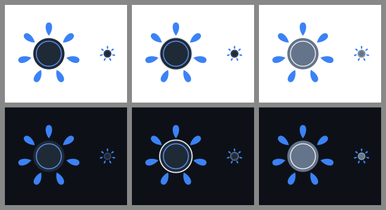
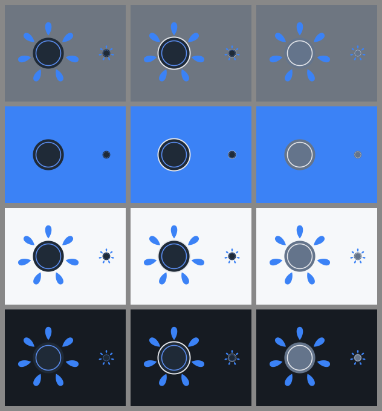
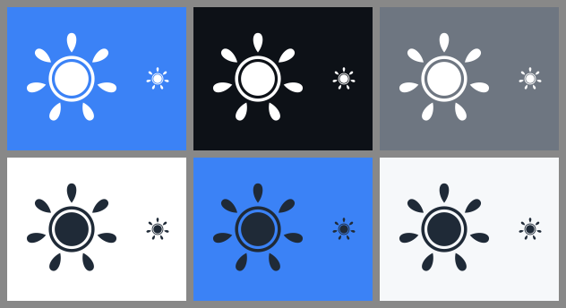
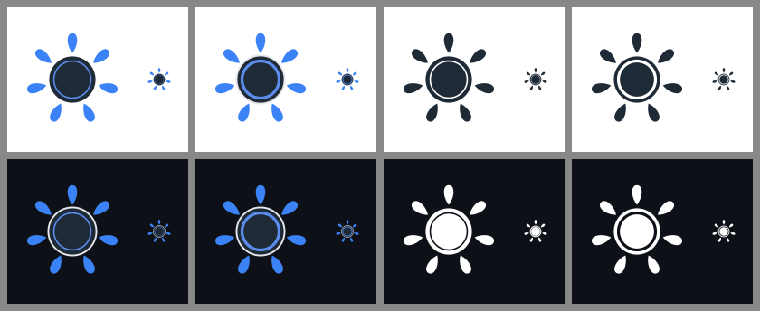

# Kubemoot mark review

Brand decision, 2026-10-03. The assets this decision produced are described in
[README.md](README.md). The images below are regenerated by `render-review.sh`; each tile
shows the mark at 128 px and at favicon size (32 px).

## The problem

The mark's table is dark navy (`#1f2a37`) with no edge of its own, so on a dark
background it disappears and only the drops remain. A mark used as an avatar, a favicon,
or in a README cannot pick its file per theme: one file has to read on light and dark.

## Three full-color options

Columns A, B, C. Top row white `#ffffff`, bottom row GitHub dark `#0d1117`.

- **A, the mark as it was: fails on dark.** The table merges into the background; the
  drops float around a faint ring.
- **B, a light keyline: recommended.** A thin light rim (`#e5e7eb`) behind the table.
  Barely visible on white, it outlines the table on dark. Same identity.
- **C, a slate table: weak on light.** Reads on both, but looks washed out on white and
  loses the mark's weight.

## Mid-tones and the brand blue

Columns A, B, C. Rows: mid gray `#6e7681`, brand blue `#3b82f6`, GitHub canvas `#f6f8fa`,
GitHub dark surface `#161b22`.

B holds on every neutral. On the brand blue the drops vanish in all three options,
because the drops are that blue. No full-color mark solves that; a one-color form does.

## One-color form, ring cut out

Top: white on brand blue, dark, and gray. Bottom: navy on white, brand blue, and GitHub
light gray. The inner ring is cut out of the table, so the background shows through it
and table and ring stay distinct in a single color.

## The ring at small sizes

Columns: full color with the 2.5-unit ring, full color with the 5-unit ring, one color
with the 2.5-unit ring, one color with the 5-unit ring. At 32 px a 2.5-unit ring in the
200-unit drawing is under half a pixel and disappears. At 5 units it reads in every form;
it is the thinnest width that does, so the ring is 5 units and the brand states a minimum
size of 24 px.

## Precedent: the Kubernetes icon

The official Kubernetes color icon
([cncf/artwork, `projects/kubernetes/icon/color`](https://github.com/cncf/artwork/tree/main/projects/kubernetes/icon/color))
carries a white outline behind the blue: invisible on white, a frame on dark. Option B
follows the same pattern. `render-review.sh` fetches that icon and renders it on white
and dark into `review/kubernetes-precedent.png` for local comparison; the render is not
committed.

## Decision

1. Full color: the mark with the light keyline (B), replacing the separate on-dark file.
2. One color: white and black forms with the ring cut out of the table, for colored
   backgrounds such as the brand blue. The black form is Table navy `#1f2a37`.
3. Small sizes: the inner ring is 5 units wide, and the minimum size is 24 px; below it
   the table is a solid disc.
4. Favicon: one adaptive SVG favicon that switches to the white form under
   `prefers-color-scheme: dark`, with 32 px and 16 px PNG fallbacks.
5. Layout: files organized as `icon/`, `horizontal/`, `stacked/`, each by `color/`,
   `black/`, `white/` (plus `white-text/` for the lockups), the structure open-source
   artwork collections expect.
6. Avatar: the keyline mark on a solid white square, regenerated from the SVG.
7. Wordmark: IBM Plex Sans SemiBold, lowercase "kubemoot", shipped as outlines.

## Sources

- [Logo design principle: versatility](https://logobird.com/principles/versatility/):
  monochrome tested in pure black and white, a reversed version for dark backgrounds, a
  stated minimum size.
- [Logo design variations](https://vimm.com/logo-design-variations/): one-color versions
  for colored backgrounds.
- [cncf/artwork](https://github.com/cncf/artwork/) and [branding.cncf.io](https://branding.cncf.io):
  icon, horizontal, and stacked layouts in color, black, and white.
- [Kubernetes logo usage guidelines](https://cos.googlesource.com/third_party/kubernetes/+show/refs/heads/release-R129/logo/usage_guidelines.md).
- [Building an adaptive favicon](https://web.dev/articles/building/an-adaptive-favicon) (web.dev)
  and [Light and dark mode favicons](https://spacejelly.dev/posts/light-dark-mode-favicons).
